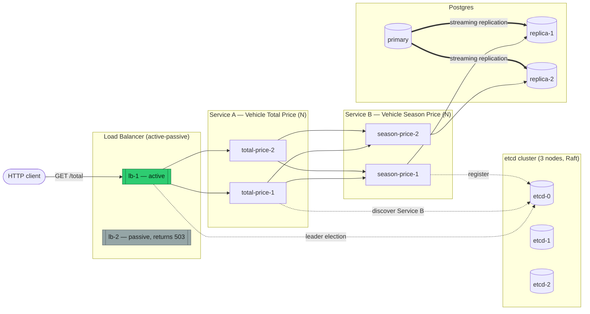

# Vehicle Rental Price Calculation System

Implements the assignment's two required microservices — **Vehicle Season Price** and
**Vehicle Total Price** — using the JSON pricing dataset provided in `assignment/`. Beyond the
base requirement, this project explores the distributed-systems themes of the course as
"additional features": each service runs as N instances, Postgres is set up with streaming
replication for fault tolerance, an active-passive Layer 7 load balancer fronts the client-facing
service, etcd provides service discovery and leader election, and the whole system is deployable
to Kubernetes.

See `assignment/` for the original assignment brief and provided dataset.

## Architecture

Solid arrows are the client request path; dotted arrows are etcd coordination (registration,
discovery, leader election) — a separate concern from the request path itself.



etcd (a 3-node Raft cluster in Kubernetes; a single node in the docker-compose dev stack) is the
coordination backbone underneath all three of: service discovery, load-balancer leader election,
and (optionally) Postgres failover via Patroni — see [docs/DESIGN.md](docs/DESIGN.md).

## Modules

| Module | Role |
|---|---|
| `common` | Shared DTOs, etcd-backed service registry/discovery ([jetcd](https://github.com/etcd-io/jetcd)), leader election, and Kubernetes pod-labeling helper ([fabric8](https://github.com/fabric8io/kubernetes-client)) |
| `service-vehicle-season-price` | Service B: looks up the daily rate for a vehicle type + season from Postgres |
| `service-vehicle-total-price` | Service A: calls Service B and multiplies by a rental period |
| `load-balancer` | Active-passive Spring Cloud Gateway in front of Service A |

## Documentation

- [docs/API.md](docs/API.md) — endpoints, example requests/responses
- [docs/SETUP.md](docs/SETUP.md) — running locally, via docker-compose, and on Kubernetes
- [docs/DESIGN.md](docs/DESIGN.md) — design decisions and assumptions
- [docs/DEMO.md](docs/DEMO.md) — fault-injection walkthrough for the presentation

## Quickest path to a running system

```bash
docker compose up --build -d
curl "http://localhost:8090/total?vehicleType=SUV&season=Winter&days=10"
# if that returns 503, the other load-balancer replica is the active one:
curl "http://localhost:8091/total?vehicleType=SUV&season=Winter&days=10"
```

Full instructions, including single-instance local dev and Kubernetes, are in
[docs/SETUP.md](docs/SETUP.md).
