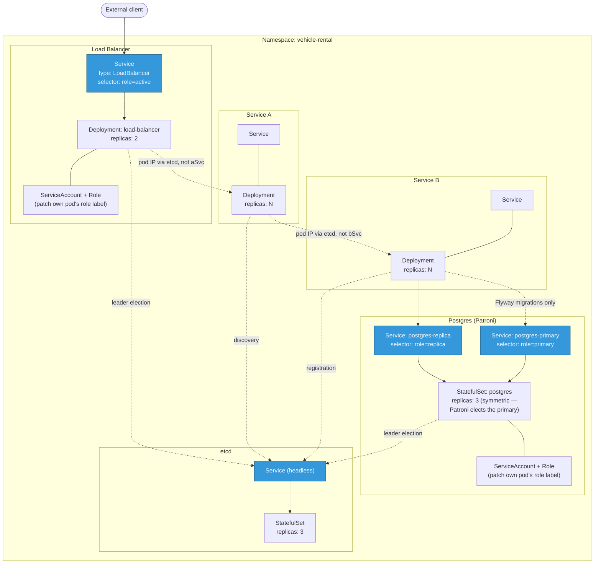

# Vehicle Rental Price Calculation System

Implements the assignment's two required microservices — **Vehicle Season Price** and **Vehicle Total Price** — using the provided JSON pricing dataset. Beyond the base requirement, this project explores the distributed-systems themes of the course as "additional features": each service runs as N instances, Postgres is set up with streaming replication for fault tolerance, an active-passive Layer 7 load balancer fronts the client-facing service, etcd provides service discovery and leader election, and the whole system is deployable
to Kubernetes.

## Architecture

### Request flow

Solid arrows are the client request path; dotted arrows are etcd coordination (registration, discovery, leader election) — a separate concern from the request path itself.

etcd (a 3-node Raft cluster in Kubernetes; a single node in the docker-compose dev stack) is the coordination backbone underneath service discovery and load-balancer leader election everywhere, plus Postgres failover via Patroni in the Kubernetes deployment specifically (docker-compose's Postgres setup only supports manual promotion) — see [docs/DESIGN.md](docs/DESIGN.md).

### Kubernetes resource topology

A different concern from the request-flow diagram above: this shows how each piece is packaged and wired up inside the cluster (Kubernetes deployment only — see [docs/SETUP.md](docs/SETUP.md) for docker-compose).

## Modules

| Module | Role |
|---|---|
| `common` | Shared components |
| `service-vehicle-season-price` | API service: reads pricing data from Postgres |
| `service-vehicle-total-price` | API service: fetches data from season price API and computes total |
| `load-balancer` | Active-passive Spring Cloud Gateway in front of total price API |

## Documentation

- [docs/API.md](docs/API.md) — endpoints, example requests/responses
- [docs/SETUP.md](docs/SETUP.md) — how to run the project locally
- [docs/DESIGN.md](docs/DESIGN.md) — design decisions and assumptions
- [demo/](demo/) — runnable fault-injection scripts for the presentation
