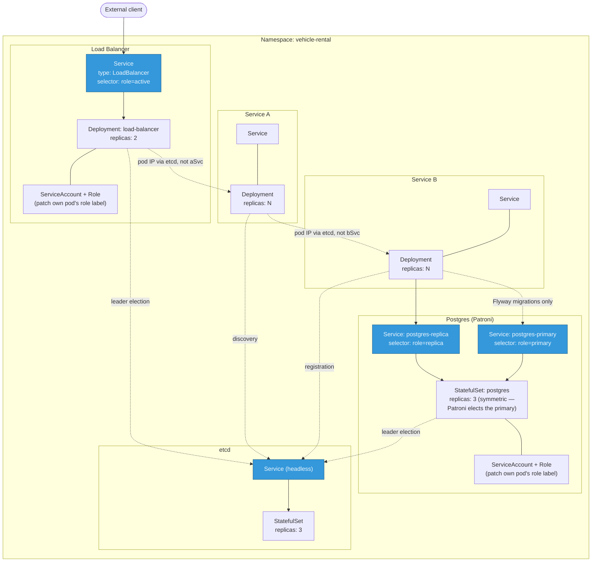

# Setup & Running

## Prerequisites

- Java 21+ (the build targets Java 21 bytecode via `maven.compiler.release`, so a newer JDK
  such as 25 works fine as the build/runtime JDK)
- Maven 3.9+
- Docker (for docker-compose and building images)
- Optional, for the Kubernetes deployment: `kubectl` and a local cluster (`kind` or `minikube`)

Build everything once from `assignment_2/`:

```bash
mvn -N install    # installs the parent POM so modules resolve it without a reactor build
mvn install -DskipTests
```

## Option 1 — Single instance, no etcd (fastest path to verifying the core requirement)

Only Postgres is needed. This mode is what `vehicle-rental.etcd.enabled=false` (the default)
gives you: Service A talks to one fixed Service B URL, and the load balancer forwards to one
fixed Service A URL — no etcd, no load-balanced discovery, no active-passive election.

```bash
docker run -d --name postgres -p 5432:5432 \
  -e POSTGRES_DB=vehicle_rental -e POSTGRES_USER=vehicle_rental -e POSTGRES_PASSWORD=vehicle_rental \
  postgres:16-alpine

cd service-vehicle-season-price
DB_HOST=localhost mvn spring-boot:run   # port 8081, applies Flyway migrations on startup

cd ../service-vehicle-total-price
mvn spring-boot:run                     # port 8080, calls http://localhost:8081

cd ../load-balancer
mvn spring-boot:run                     # port 8090, forwards to http://localhost:8080
```

```bash
curl "http://localhost:8080/total?vehicleType=SUV&season=Winter&days=10"   # Service A directly
curl "http://localhost:8090/total?vehicleType=SUV&season=Winter&days=10"   # through the LB
```

## Option 2 — Full stack via docker-compose (recommended for seeing the distributed features)

Brings up: 1 etcd node, 1 Postgres primary + 2 read replicas, 2 Service B instances (one per
replica), 2 Service A instances, 2 load-balancer instances (active-passive).

```bash
docker compose up --build -d
docker compose ps          # everything should show "Up" within ~45s (JVM + Flyway startup)
```

The two load-balancer instances are each on their own host port, since compose has no
Kubernetes-style Service selector to route only to the leader — check both, the leader answers
200, the other answers 503:

```bash
curl -s -o /dev/null -w "%{http_code}\n" "http://localhost:8090/total?vehicleType=SUV&season=Summer&days=2"
curl -s -o /dev/null -w "%{http_code}\n" "http://localhost:8091/total?vehicleType=SUV&season=Summer&days=2"
```

Other useful ports: `8081`/`8082` (the two Service B instances directly), `8080`/`8083` (the two
Service A instances directly), `55432` (Postgres primary, for `psql`), `2379` (etcd).

Tear down: `docker compose down` (add `-v` to also drop the Postgres/etcd data volumes).

See [../demo/](../demo/) for runnable fault-injection scripts against this stack.

## Option 3 — Kubernetes

Manifests are in `k8s/`, applied in filename order (`00-` through `50-`). This is the resource
topology they create — a different concern from the request-flow diagram in the root
[README.md](../README.md): that one shows which service calls which; this one shows how each
piece is packaged and wired up inside the cluster.



A subtlety the diagram calls out: `aSvc` and `bSvc` (the plain `ClusterIP` Services for Service A
and Service B) exist mainly for conventional in-namespace addressability and debugging
(`kubectl exec ... curl http://service-vehicle-season-price:8081/...`) — the *actual* request
traffic bypasses them entirely and goes straight to pod IPs that Spring Cloud LoadBalancer
resolved via etcd (see [DESIGN.md](DESIGN.md)). The highlighted (blue) Services are the ones
genuinely on the hot path: the load balancer's Service (the only way in, and the mechanism behind
active-passive routing), and Postgres's two Services — both select against the *same* StatefulSet
by its Patroni-managed `role` label (mirroring exactly how the load balancer's Service selects on
`role=active`), not two separate pod groups, so kube-proxy's endpoint list always reflects
whichever pod Patroni currently considers primary or replica. etcd's Service is used by clients as
a set of endpoints to connect to, same as the docker-compose setup, just multiplied by three
nodes — and now also by Patroni itself, coordinating Postgres leader election under its own key
prefix, isolated from the other two uses of the same cluster.

```bash
# Build the application images (reuses the same Dockerfiles as docker-compose, plus the
# Patroni-managed Postgres image used only in this Kubernetes path — see db/patroni/)
docker build -t vehicle-rental/postgres-patroni:latest ./db/patroni
docker build -t vehicle-rental/service-vehicle-season-price:latest -f service-vehicle-season-price/Dockerfile .
docker build -t vehicle-rental/service-vehicle-total-price:latest -f service-vehicle-total-price/Dockerfile .
docker build -t vehicle-rental/load-balancer:latest -f load-balancer/Dockerfile .

# Make the images available to your cluster (pick the one matching your tool):
kind load docker-image vehicle-rental/postgres-patroni:latest vehicle-rental/service-vehicle-season-price:latest vehicle-rental/service-vehicle-total-price:latest vehicle-rental/load-balancer:latest
# or: minikube image load vehicle-rental/postgres-patroni:latest ...

kubectl apply -f k8s/
kubectl -n vehicle-rental get pods -w   # wait for everything to reach Running/Ready
```

Reaching the client-facing load balancer:

```bash
kubectl -n vehicle-rental port-forward svc/load-balancer 8090:80
curl "http://localhost:8090/total?vehicleType=SUV&season=Winter&days=10"
```

Confirm exactly one load-balancer pod is labeled active (the client-facing Service only routes
there):

```bash
kubectl -n vehicle-rental get pods -l app=load-balancer --show-labels
```

Tear down: `kubectl delete namespace vehicle-rental`.

## Configuration reference

All settings are environment variables (see each module's `application.yml` for the full list
and defaults):

| Variable | Meaning |
|---|---|
| `SERVER_PORT` | This instance's HTTP port |
| `INSTANCE_ID` | Identifier shown in API responses / etcd registration |
| `INSTANCE_HOST` | Host/IP this instance advertises to etcd for others to call it back on |
| `DB_HOST` / `DB_PORT` / `DB_NAME` / `DB_USER` / `DB_PASSWORD` | Service B's runtime (read) datasource |
| `FLYWAY_DB_HOST` / `FLYWAY_DB_PORT` / ... | Service B's migration datasource — must point at the writable primary |
| `ETCD_ENABLED` | `true` to turn on etcd-backed discovery/election; `false` (default) for fixed-URL single-instance mode |
| `ETCD_ENDPOINTS` | Comma-separated etcd client URLs |
| `ETCD_LEASE_TTL_SECONDS` | How long a dead instance's etcd registration/leadership survives before expiring (load balancer default: 10s) |
| `SEASON_PRICE_SERVICE_URL` / `TOTAL_PRICE_SERVICE_URL` | Fixed upstream URL, used only when `ETCD_ENABLED=false` |
